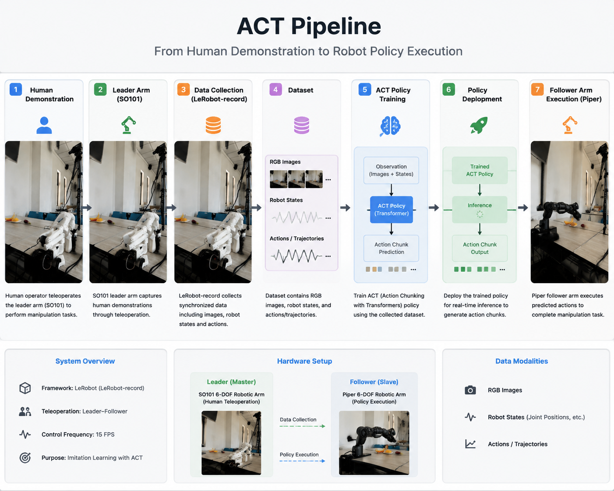
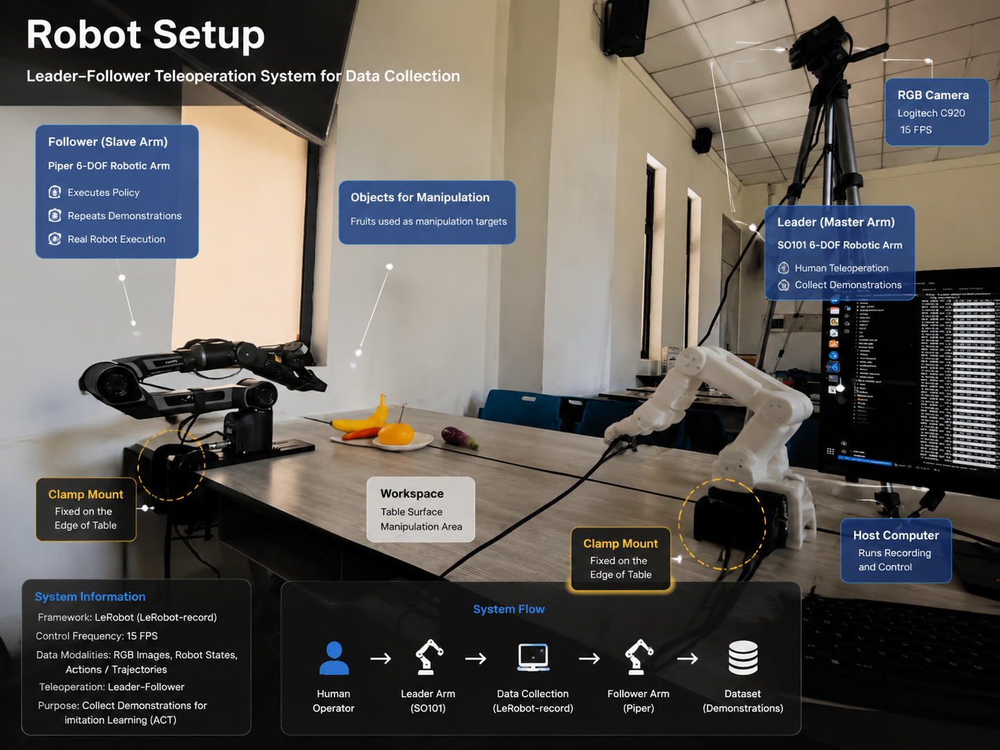

# ACT-robot-manipulation

A robot imitation learning project based on Action Chunking with Transformers (ACT).

This project explores learning visuomotor manipulation policies from real robot demonstrations collected through a leader-follower teleoperation system.

The pipeline includes robot demonstration collection, dataset processing, ACT policy training and real robot deployment.

# 🎥 Demo

  

# Overview

Action Chunking with Transformers (ACT) is a transformer-based imitation learning method that predicts future action sequences from robot observations.

This project investigates ACT-based manipulation learning on a real robotic platform.

The overall pipeline:

  

Human Demonstration  
↓  
SO101 Leader Arm  
↓  
LeRobot-record Data Collection  
↓  
Dataset Processing  
↓  
ACT Policy Training  
↓  
Piper Robot Deployment

# Hardware

  

The system uses a leader-follower teleoperation setup.

## Leader Arm

- SO101 robotic arm
- Human-operated demonstration device

## Follower Arm

- Piper robotic arm
- Executes recorded manipulation trajectories

Data collection was performed using:

- LeRobot-record framework

---

# Dataset

Real robot demonstrations collected through LeRobot-record.

Statistics:

| Item | Value |
|---|---|
| Episodes | 55 |
| Frames | 13,311 |
| Frequency | 15 FPS |
| Episode Duration | ~30 seconds |
| Robot | Piper |
| Collection Method | LeRobot-record |

Modalities:

- RGB camera observations
- Robot states
- Action trajectories

More details:

📄 [Dataset Documentation](docs/dataset.md)

# Training 

The ACT policy is trained using the LeRobot training framework.

Training process:
LeRobot Dataset
    ↓
ACT Policy
    ↓
Behavior Cloning Training
    ↓
Checkpoint

Training details:

📄 [Training Documentation](docs/training.md)

# Deployment

The trained ACT checkpoint is deployed on the real Piper robot using LeRobot rollout.
Deployment pipeline:
ACT Checkpoint
    ↓
LeRobot Rollout
    ↓
Camera Observation
    ↓
ACT Policy
    ↓
Robot Action
    ↓
Piper Execution
Deployment details:

📄 [Deployment Documentation](docs/deployment.md)

# Repository Structure

ACT-robot-manipulation

├── README.md

├── assets
│ ├── robot_setup.png
│ ├── pipeline.png
│ └── demo.gif

├── configs
│ └── act.yaml

├── data

├── docs
│ ├── dataset.md
│ ├── training.md
│ └── deployment.md

└── results

---

# ACT vs VLA

This project serves as an imitation learning baseline for comparison with Vision-Language-Action models.

| | ACT | smolVLA |
|-|-|-|
| Learning Type | Imitation Learning | Vision-Language-Action |
| Input | Vision + Robot State | Vision + Language + Robot State |
| Training | Behavior Cloning | VLA Fine-tuning |
| Output | Action Chunk | Action Chunk |
| Language Understanding | No | Yes |

---

# Future Work

- Increase demonstration diversity
- Improve task generalization
- Compare ACT with VLA-based policies
- Evaluate different robot manipulation tasks
